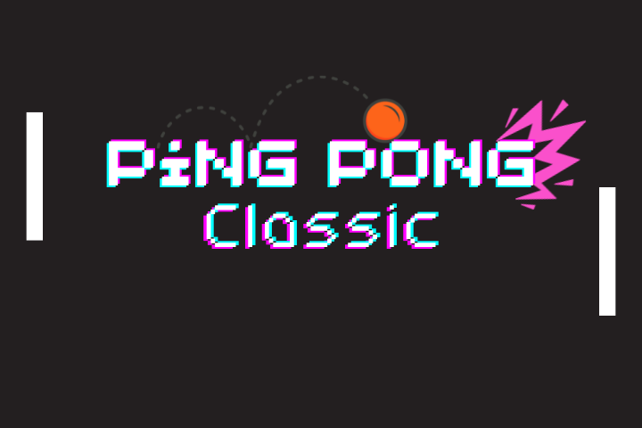
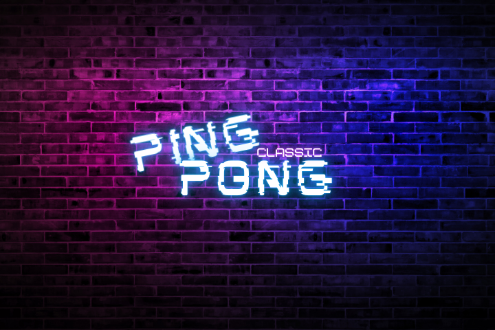

## 

# ABOUT PING PONG CLASSIC 
-------------
### Made with c++ using raylib
-------------------------
### Basic paddle and simple interface
--------------
# How to Play

## Download the Zip file by clicking over code.
--------------------
Extract the files and run the exe.
----------------------------------
## Enjoy

--------
# Entarface Demo
----------
#### 
#### 